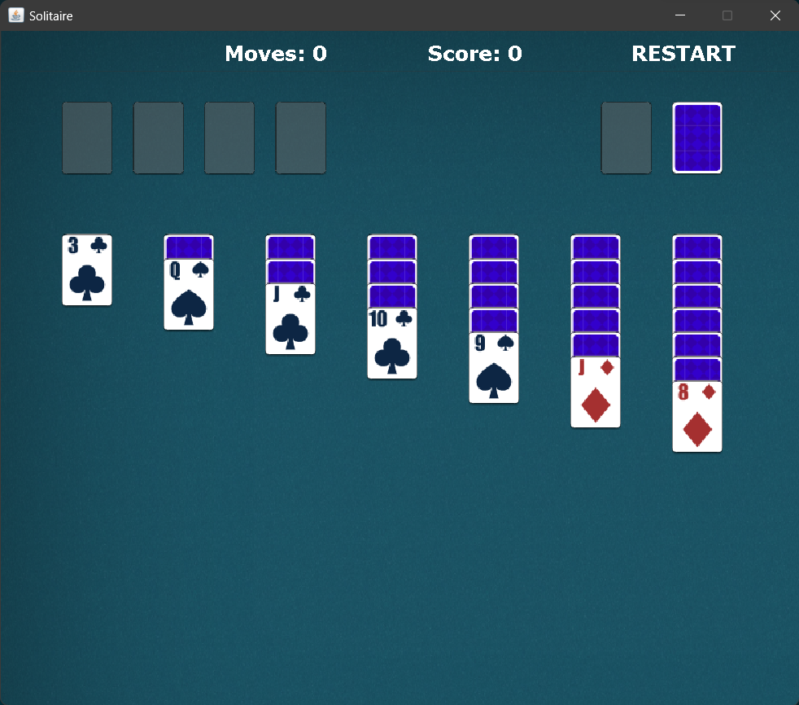
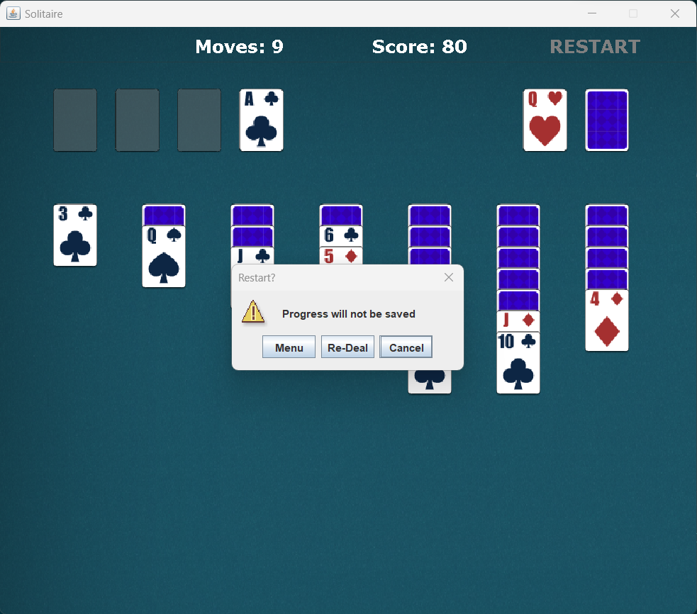
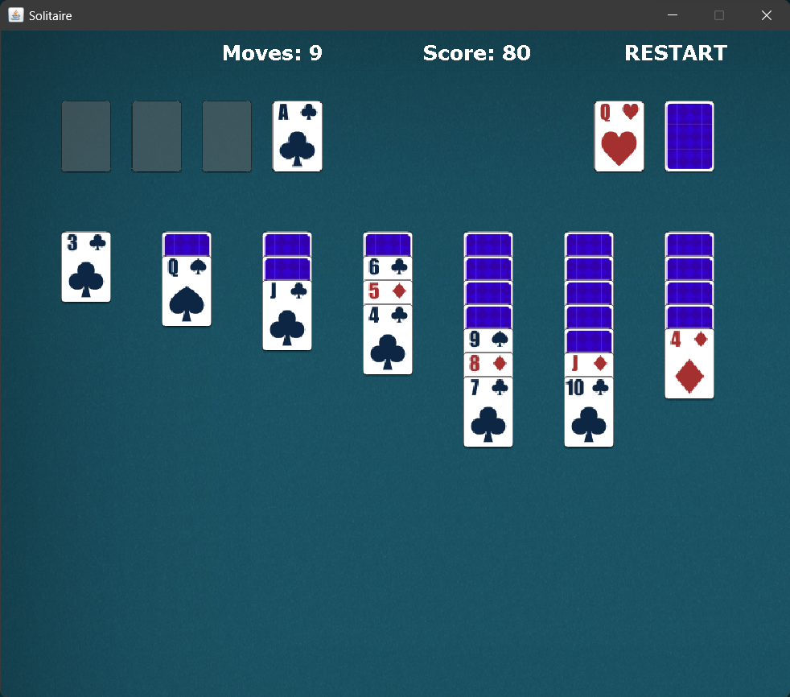
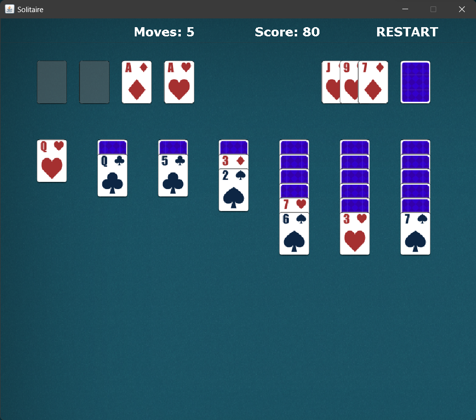

# Solitaire

[About](#about) ◈ [Installation](#installation) ◈ [How to use](#how-to-use) ◈ [Features](#features) ◈ [Scoring scheme](#scoring-scheme)

## About

> [!NOTE]  
> This project was made for a school assignment. It is no longer maintained.

This is a minimal Classic (Klondike) Solitaire game.

## Installation

### Windows

1. Download source code as a *.zip* file
2. Unzip it into a new folder

## How to use

1. Run *Solitaire.java*
2. Click on the game type that you want to play (draw 3 or draw 1)
3. Click on the deck (face down part) to draw cards
4. Click and drag the cards to move them from the deck to a tableau, foundation pile, etc.
5. Press "Restart" if the game is stuck or you want to change game type. You will have the option to re-deal the cards or go back to the menu page

    

## Features

 - Draw 1 or draw 3 game

  
  

 - Displays top 3 high scores (see below for scoring scheme)
 - Re-deal a game without exiting

## Scoring scheme

It has been modified from Microsoft Solitaire's scoring scheme

|Move|Points|
|---|---|
|Card moved onto foundation pile|`+15`|
|Card removed from foundation pile|`-20`|
|Card moved from deck to tableau|`+5`|
|Card moved from one tableau to another|`+5`|
|Facedown card turned faceup|`+10`|
|Every 2 passes after 3 passes (4, 6, 8, etc) in *Draw 3*|`-50`|
|Every pass after 2 passes (3, 4, 5, etc) in *Draw 1*|`-50`|